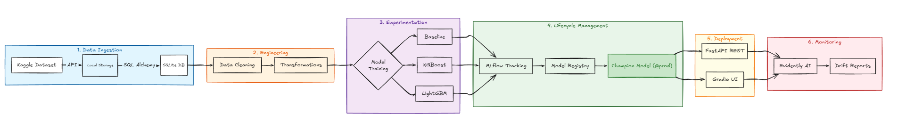
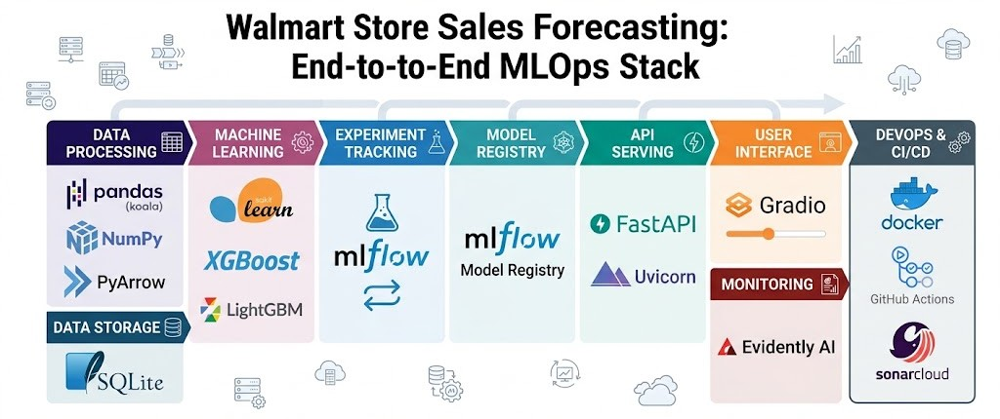
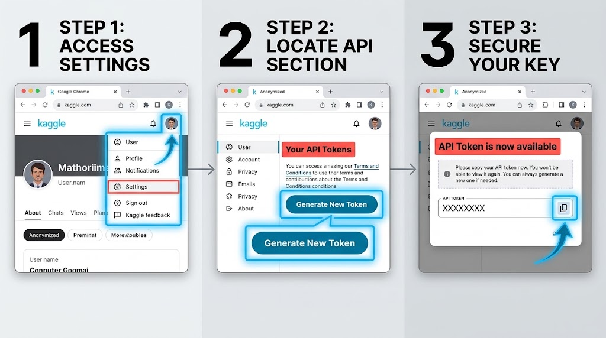
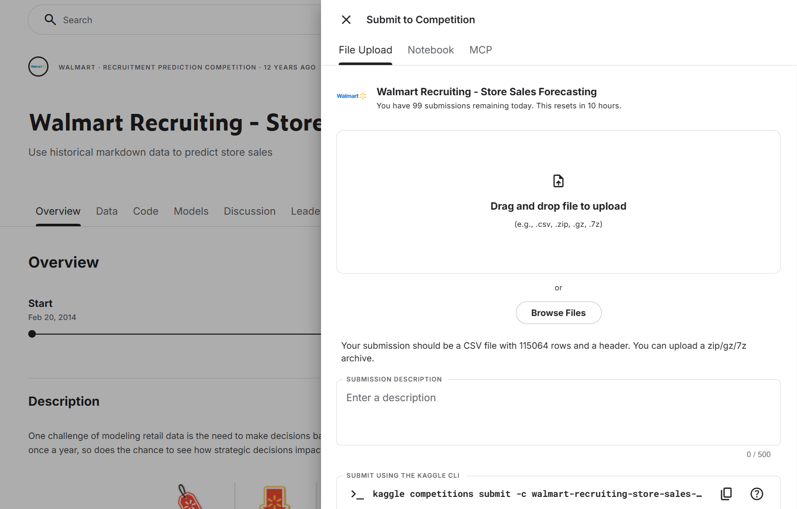
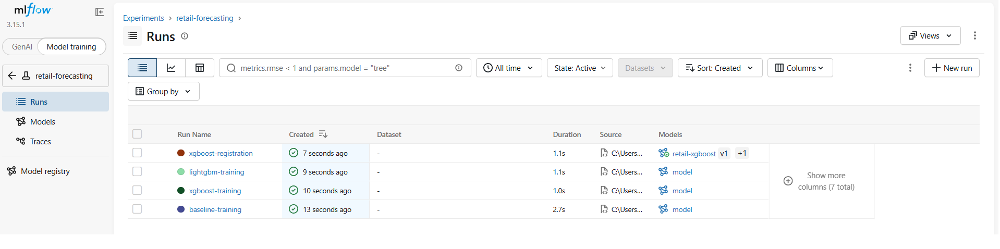
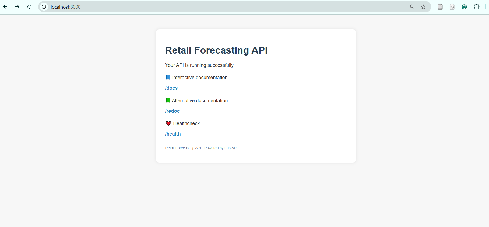
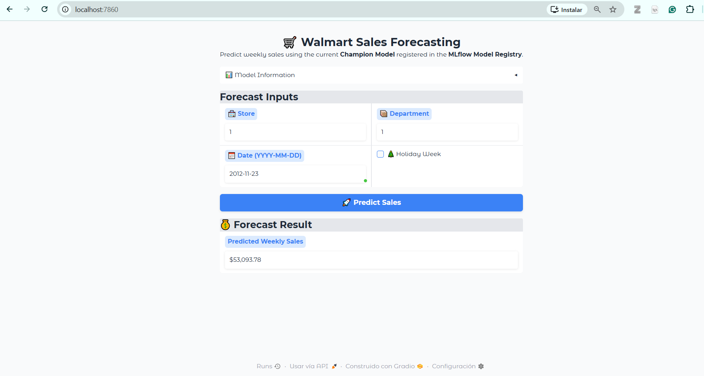
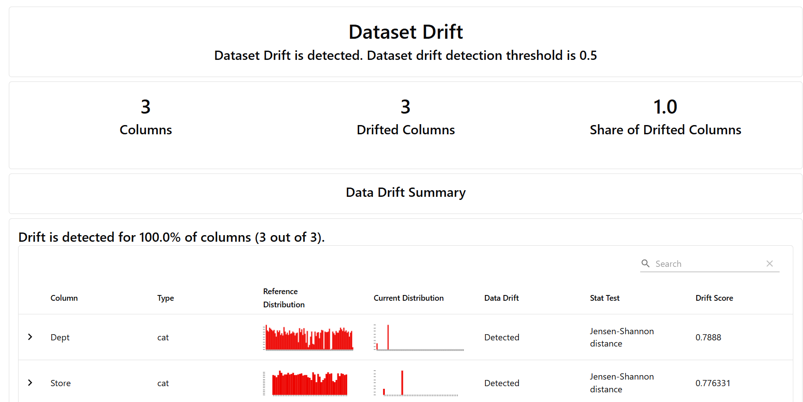
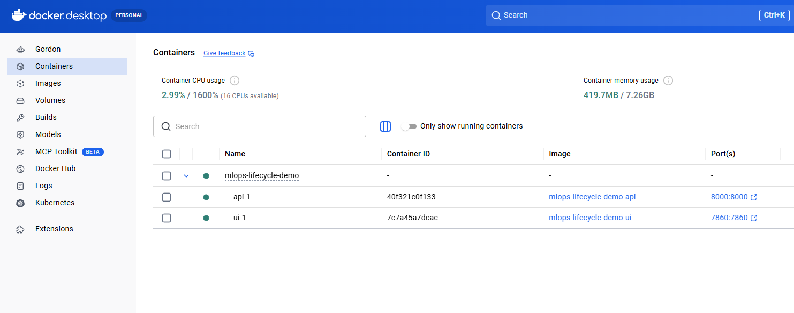

# 🛒 MLOps End-to-End Lifecycle Demo: Walmart Sales Forecasting

An enterprise-grade, end-to-end MLOps lifecycle implementation predicting weekly sales across different Walmart stores and departments based on based on the **[Walmart Store Sales Forecasting Dataset](https://www.kaggle.com/datasets/aslanahmedov/walmart-sales-forecast)**. This project covers data version control, experiment tracking, automated pipelines, model registry, containerization, monitoring, and a full-stack serving layout.

[](https://www.python.org/downloads/)
[](https://github.com/astral-sh/uv)
[](https://dvc.org/)
[](https://mlflow.org/)
[](https://fastapi.tiangolo.com/)
[](https://gradio.app/)

---
## 📚 Table of Contents

- [🎯 Project Objectives](#-project-objectives)
- [📁 Repository Structure](#-repository-structure)
- [📊 Data Overview](#-data-overview)
- [🛠 Technologies and Architecture](#-technologies-and-architecture)
- [⚙ Centralized Configuration](#-centralized-configuration)
- [🚀 Quick Start](#-quick-start)
  - [Prerequisites](#a-kaggle-api-token)
  - [Setup & Installation](#2-setup--installation)
- [🕹️ How to Run the Project](#️-how-to-run-the-project)
  - [Step 1: Start the MLflow Tracking Server](#step-1-start-the-mlflow-tracking-server)
  - [Step 2: Execute the MLOps Pipeline](#step-2-execute-the-mlops-pipeline)
  - [Step 3: Production Serving](#step-3-production-serving-choose-your-approach)
  - [Step 4: Production Logging & Drift Monitoring](#step-4-production-logging--drift-monitoring)
- [🏅 Kaggle Submission](#-kaggle-submission-overview)
- [🧩 Step-by-Step Learning Path](#-step-by-step-learning-path-git-branches)
- [🧭 Overview](#-overview)
  - [Model Training](#-model-training-overview)
  - [MLflow Experiment Tracking](#-mlflow-experiment-tracking)
  - [Model Registry](#-model-registry)
  - [FastAPI Service](#-fastapi-service)
  - [Gradio UI](#-gradio-ui)
  - [Monitoring & Drift](#-monitoring--drift)
  - [Dockerization](#-dockerization)
  - [CI/CD](#-cicd)
- [🚀 Future Roadmap](#-future-roadmap--improvements)
- [📄 License](#-license)

## 🎯 Project Objectives

This project demonstrates a production-ready, end-to-end MLOps implementation designed to showcase industry best practices:

* **Pipeline Reproducibility:** Build fully reproducible machine learning pipelines using [DVC](https://dvc.org/).
* **Experiment Tracking** Centralized metrics, parameters, and model registry via [MLflow](https://mlflow.org/).
* **Model Serving:** Expose model predictions via [FastAPI](https://fastapi.tiangolo.com/) backend.
* **Interactive Frontend:** Provide an intuitive user interface utilizing [Gradio](https://gradio.app/).
* **Production Monitoring:** Detect data and model drift post-deployment using [Evidently AI](https://www.evidentlyai.com/).
* **Containerization:** Package multi-service micro-architectures using [Docker](https://www.docker.com/).
* **CI/CD Automation:** Automate code quality checks, testing, and deployment workflows via [GitHub Actions](https://github.com/features/actions).



> **Note**
> This project uses the public Walmart Store Sales Forecasting dataset from Kaggle. All examples, metrics, and artifacts shown in this repository are generated exclusively from this dataset. No proprietary, sensitive, or confidential business information is used or exposed at any stage.

---

## 📁 Repository Structure

```text
mlops-lifecycle-demo/
│
├── api/                  # FastAPI service for model predictions
├── data/                 # Datasets used for training and inference
├── db/                   # Database files
├── docs/                 # Documentation assets (images, guides)
├── logs/                 # Application and execution logs
├── mlruns/               # MLflow tracking directory
├── models/               # Saved model artifacts (e.g., champion.pkl)
├── monitoring/           # Model drift detection and reporting scripts
├── notebooks/            # Jupyter notebooks for EDA and experimentation
├── src/                  # Core source code (pipelines, features, utils)
│   ├── data/             # Data ingestion and preprocessing scripts
│   ├── features/         # Feature engineering scripts
│   ├── models/           # Model training and evaluation scripts
│   ├── pipelines/        # ML pipelines orchestration
│   └── utils/            # Helper utilities
├── ui/                   # Frontend user interface (Streamlit/Gradio)
│
├── .dockerignore         # Docker ignore file
├── .env                  # Local environment variables
├── .env.example          # Example environment configuration
├── .gitignore            # Git ignore file
├── docker-compose.yml    # Docker Compose multi-container setup
├── Dockerfile.api        # Dockerfile for the API service
├── Dockerfile.ui         # Dockerfile for the UI service
├── dvc.yaml              # DVC pipeline definition
└── mlflow.db             # MLflow SQLite backend database
```

---

## 📊 Data Overview

**Goal:** Predict weekly sales across different Walmart stores and departments.  
**Target:** `Weekly_Sales`  
**Source:** Kaggle's [Walmart Store Sales Forecasting](https://www.kaggle.com/datasets/aslanahmedov/walmart-sales-forecast) dataset.  

**Files used:** `train.csv`, `test.csv`, `stores.csv`, `features.csv`

---

## 🛠 Technologies and Architecture




---


## ⚙ Centralized Configuration

All pipeline settings, feature definitions, and model hyperparameters are centralized in a single configuration file:

[`params.yaml`](./params.yaml)

This file acts as the source of truth for the entire MLOps workflow. Any update to model settings, feature lists, or training parameters is managed here.

### Example

```yaml
train:
  target: Weekly_Sales
  models:
    - baseline
    - xgboost
    - lightgbm
  feature_set:
    - Store
    - Dept
    - IsHoliday
    ...
```

This file controls:

* Feature selection

* Model hyperparameters (baseline, XGBoost, LightGBM)

* Training pipeline parameters (random state, model list, feature groups)

* MLflow experiment and registry behavior

* Dataset metadata and paths

Any change made in `params.yaml` automatically propagates through DVC pipelines, MLflow runs, and the serving stack, keeping the entire lifecycle aligned and reproducible.

---

## 🚀 Quick Start

### 1. Prerequisites

Make sure you have the following ready before running the project:

### A. Kaggle API Token
The automated data ingestion pipeline pulls datasets directly from Kaggle via API.

1. Sign in to [Kaggle](https://www.kaggle.com/).
2. Go to your **Account Settings**.
3. Scroll to the **API** section and click **Generate New Token**:
   ```text
   Kaggle ➔ Settings ➔ API ➔ Generate New Token
   ```



> ⚠️ **Important:** Kaggle only provides this key at the moment of creation. Save or copy your credentials immediately—if you lose them, you will need to generate a new key.

### B. Python and `uv` Package Manager
This project leverages **uv** for lightning-fast dependency management.

* Install `uv` via the [official installation guide](https://docs.astral.sh/uv/getting-started/installation/).
* Verify the installation in the terminal:

  ```bash
  uv --version
  ```

### C. Docker Desktop (Optional)
If you want to run the application services (API and UI) inside containerized environments using Docker Compose, make sure you have the latest version of [Docker Desktop](https://www.docker.com/products/docker-desktop/) installed and running on your machine.

---

### 2. Setup & Installation

### Step 1: Clone the Repository
```bash
git clone [https://github.com/](https://github.com/)<your-user>/mlops-lifecycle-demo.git
cd mlops-lifecycle-demo
```
---

### Step 2: Configure Environment Variables
Copy the template environment file and populate your Kaggle credentials:

```bash
cp .env.example .env
```

Open `.env` and fill in your details:

```env
KAGGLE_USERNAME=your_username
KAGGLE_KEY=your_api_key
```

---

### Step 3: Install Dependencies with `uv`
Run the synchronization command from the project root:

```bash
uv sync
```

> ℹ️ **What `uv sync` does:**
> * Creates an isolated virtual environment (`.venv`)
> * Installs all project dependencies from the lockfile
> * Ensures exact environment reproducibility
>
> *(Learn more in the [uv project layout documentation](https://docs.astral.sh/uv/concepts/projects/layout/))*

---

### Step 4: Activate Virtual Environment
Activate `.venv` according to your operating system:

**Windows (PowerShell):**
```powershell
.\.venv\Scripts\Activate
```

**macOS / Linux:**
```bash
source .venv/bin/activate
```

*(Your terminal prompt will now prefix with the .venv name)*

> Note: If you experience activation issues on Windows (PowerShell execution policy, WSL conflicts, or Docker interference), you can safely bypass manual activation by prefixing all commands with:
`uv run <command>` and uv automatically activates the correct environment for you.


🚀 **You are now ready to run the project pipeline!**

---

## 🕹️ How to Run the Project

To run the full automated workflow—from data ingestion and model training to experiment tracking and production serving—follow the steps below.

---

### Step 1: Start the MLflow Tracking Server
Before running the pipeline, spin up the local MLflow server. Run the following command from the project root:

```bash
mlflow server --backend-store-uri sqlite:///mlflow.db --default-artifact-root ./mlruns --host 127.0.0.1 --port 5000 --workers 1
```
Once the server starts, you should see logs similar to:

```text
2026/08/25 22:28:41 INFO:     Started server process [7896]
2026/08/25 22:28:41 INFO:     Waiting for application startup.
2026/08/25 22:28:41 INFO:     Application startup complete.
2026/08/25 22:28:41 INFO:     Uvicorn running on http://127.0.0.1:5000 (Press CTRL+C to quit)
```
This means the MLflow UI is available at http://127.0.0.1:5000. You can open it in your browser.

> **IMPORTANT**: Keep this terminal running.
The MLflow server must stay active while you execute the rest of the pipeline.

---

### Step 2: Execute the MLOps Pipeline
With the tracking server active (keep that terminal running), open a **new clean terminal window** from the **root of the project** to continue with the workflow.

From this new terminal, orchestrate the end‑to‑end workflow using DVC.  
DVC automatically manages data lineage, dependencies, and stage caching:


```bash
dvc repro
```

This executes the complete data and model lifecycle DAG stages:

```text
Data Ingestion ➔ SQLite Load ➔ Feature Engineering ➔ Model Training ➔ MLflow Tracking ➔ Model Registry
```

Alternative (Python Wrapper): You can also run the core training pipeline sequentially via Python:

```bash
python -m src.pipelines.training_pipeline
```
> Note: While this executes the same logical workflow, it runs without DVC’s reproducibility guarantees, automatic dependency tracking, or stage re-execution caching.

---

### Step 3: Production Serving (Choose Your Approach)

Now that your model is trained and registered, it's time to serve it via the FastAPI backend and the Interactive UI. You can choose between a containerized deployment or running the services locally.

---

#### Option A: Containerized Deployment (Recommended)

Run the entire system in an isolated, production‑like environment without worrying about local dependencies:

```bash
docker compose up --build
```

#### Option B: Local Execution (Without Docker)

If you prefer not to use Docker, you can run the services natively in your Python environment. Open two separate terminal windows:

* Terminal 1: Run the FastAPI Backend
    ```bash
    uvicorn api.api:app --reload --host 0.0.0.0 --port 8000
    ```

* Terminal 2: Run the Interactive UI
    ```bash
    python -m ui.app
    ```

Once running (via either method), access your services at:

* API Endpoint: http://localhost:8000 (Interactive Swagger docs available at /docs)

* Interactive UI: http://localhost:7860


### Step 4: Production Logging & Drift Monitoring
As predictions are made (either through the API or the UI), they are automatically appended to:

```bash
monitoring/prediction_logs.csv
```

These logs are compared against a reference dataset to detect data or model drift.
Evidently AI generates an HTML dashboard summarizing feature stability and target drift.

Generate the drift report:
```bash
python -m monitoring.drift
```
This produces:
```bash
reports/drift_report.html
```

A visual summary of drift metrics and data health.

---

## 🏅 Kaggle Submission (Overview)

While leaderboard ranking is strictly **out of scope** for this project, you can easily evaluate your iterative model improvements against Kaggle's official test set.

Generating a submission automatically utilizes the current **`@champion`** model from the registry:

```bash
uv run python -m src.pipelines.inference_pipeline
```

This generates `submission.csv` in the root directory, formatted and ready to upload directly to Kaggle so you can benchmark your experiments!

🔗 **Competition Link:** [Walmart Recruiting - Store Sales Forecasting](https://www.kaggle.com/competitions/walmart-recruiting-store-sales-forecasting)



---

## 🧩 Step-by-Step Learning Path (Git Branches)

If you prefer exploring or developing the system incrementally following industry-standard MLOps maturity steps, you can switch between dedicated feature branches:

| Branch Name | Scope / Focus | MLOps Practice Highlight |
| :--- | :--- | :--- |
| `feature/01-data-ingestion` | Automated data download & extraction | Automated ingestion from source APIs |
| `feature/02-sql-layer` | Local SQLite database setup & storage | Structured persistence layer |
| `feature/03-eda` | Exploratory data analysis & quality checks | Data validation & profiling |
| `feature/04-data-preparation` | Data preprocessing & feature pipelines | Modular transformation scripts |
| `feature/05-model-training` | Model development & evaluation | Algorithm benchmarking & tuning |
| `feature/06-mlflow` | MLflow experiment tracking integration | Metric & parameter governance |
| `feature/07-dvc` | Data versioning & stage tracking | Reproducible data pipelines |
| `feature/08-fast-api` | REST API development with FastAPI | Production-grade model serving |
| `feature/09-gradio-ui` | Interactive user interface with Gradio | Stakeholder accessibility |
| `feature/10-monitoring` | Performance, data drift & observability | Post-deployment monitoring (Evidently) |
| `feature/11-docker` | Containerizing application services | Environment parity & microservices |
| `feature/12-ci-cd` | Automated CI/CD workflows & testing | Continuous integration & deployment |

> **Tip:** Switch to any module using `git checkout <branch-name>` to inspect or test specific implementations independently.

---

## 🧭 Overview

### Model Training

The project trains three forecasting models — **Baseline**, **XGBoost**, and **LightGBM** — using a unified, automated pipeline.  
Core steps such as feature validation, chronological splitting, model evaluation, and MLflow logging are handled internally.


---

### MLflow Experiment Tracking

All training runs are automatically logged to MLflow, including:
* Hyperparameters  
* Metrics (MAE, RMSE)  
* Execution time  
* Artifacts (models, plots, preprocessing steps)



---

### Model Registry

The best-performing model is promoted to the **MLflow Model Registry** under the `@champion` alias or Promotion Stage.  
The serving stack (API/UI) always loads this alias, enabling seamless model updates without code changes.

---

### FastAPI Service

The API exposes:
- `GET /health` — service + registry status  
- `POST /predict` — real-time weekly sales prediction  



---

### Gradio UI

The UI provides an interactive form for single predictions, automatically using the current `@champion` model.



---

### Monitoring & Drift

Production predictions are logged (`monitoring/prediction_logs.csv`) and compared against a reference dataset to detect drift.  
[Evidently AI](https://www.evidentlyai.com/) generates an HTML dashboard summarizing feature and target stability.



---

### Dockerization

The project includes a full multi-service Docker setup (API + UI).  
You can run the stack entirely in containers or mix local execution with Docker services.



---

### CI/CD

GitHub Actions pipelines support linting, testing, and static analysis (Ruff, Pytest, SonarCloud).


---

## 🚀 Future Roadmap & Improvements

Future iterations will explore:
* Feature Store integration (e.g., Feast)
* Automated hyperparameter tuning with Optuna
* Automated retraining triggers upon drift detection
* Batch inference pipeline orchestrators (e.g., Prefect / Airflow)
* Cloud deployment (AWS / GCP / Azure)
* Kubernetes deployment (KServe / Helm charts)

---

## 📄 License
MIT License

Copyright (c) 2026 Paula Martín-Palomeque